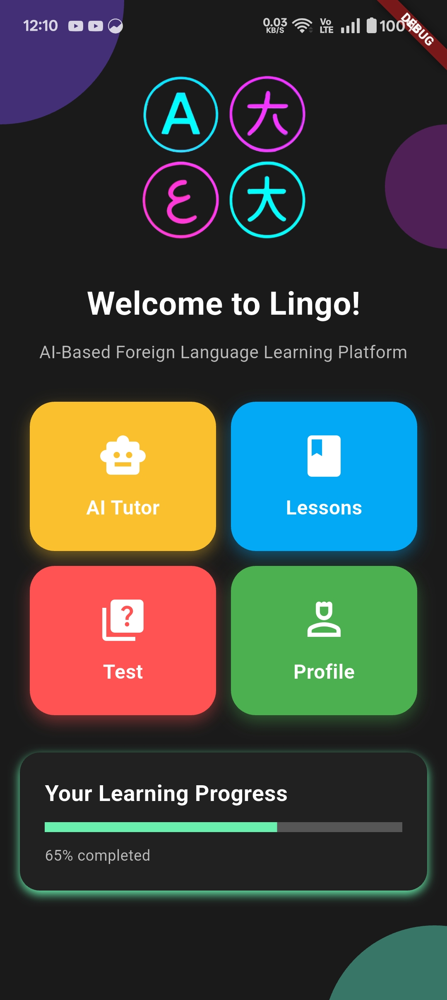
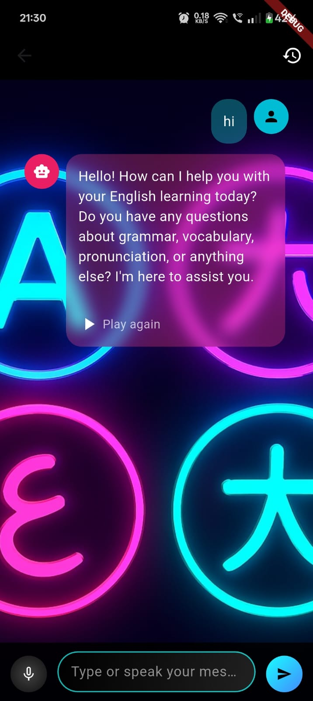
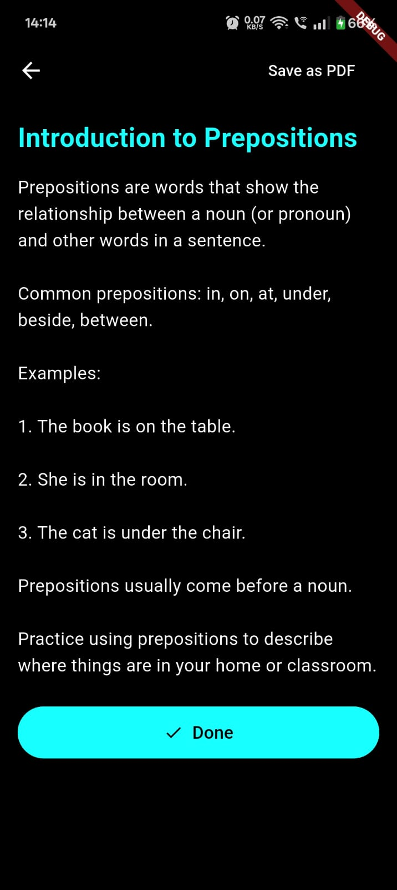
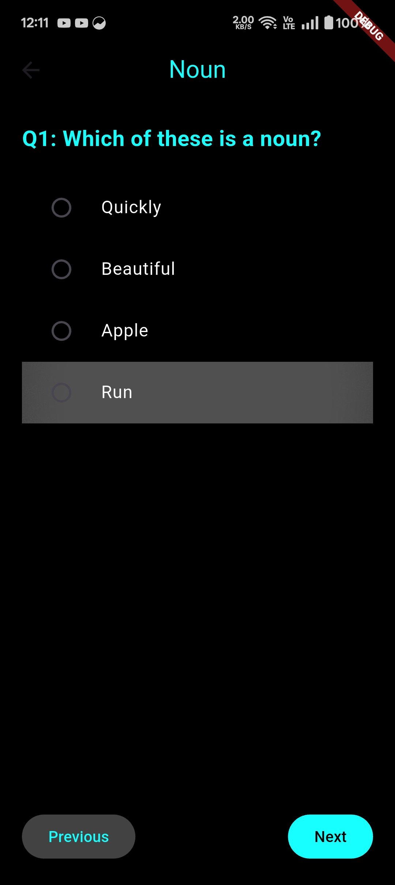

# Lingo - AI Based english learning app

## Features
- AI Chatbot with voice which can seemlessly talk to the users and improve their english conversation skills (Kokoro & gemini).
- Chat history.
- Lessons for beginners, intermediate and advanced learners.
- Quizzes and quiz reports.
- Progress report.
- Profile view and update.
- Login / Signup (JWT authentication)

## Images
| Home Screen | AI Chat Screen |
| ------------- | -------------- |
|  |  |

| Lesson Screen | Test Screen |
| ------------- | -------------- |
|  |  |

## Contributors
1. Poorab Patel - Backend (Node.js)
2. Harsh Nair - Mobile App (Flutter)
3. Sujeet Ghosh - Mobile App (Flutter)
4. Raghav Pandit - AI backend (Python + Kokoro + Gemini) & wokred on few of API integration (Flutter & Dio)
